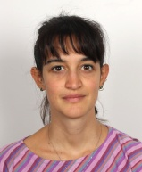
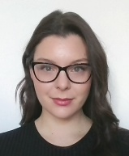




<section class="committee">

  

  
  <h3>Egle Mocciaro</h3>
  
Associate Professor in Italian Linguistics

   

  
  <h3>Valeria de Tommaso</h3>
  
Language instructor for Italian

  
  <h3>Eleonora Zucchini</h3>
  
Assistant professor in Italian Linguistics

  
  <h3>Elizabeth Tobyn</h3>
  
Post-doc researcher in Linguistics

  <!-- SEZIONE PHD STUDENTS -->

  <h2 class="phd-title">PhD Students</h2>
  

    

      
      <h3>Kristyna Lorenzova</h3>
      
PhD Student

    

  

</section>